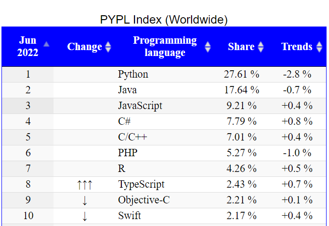
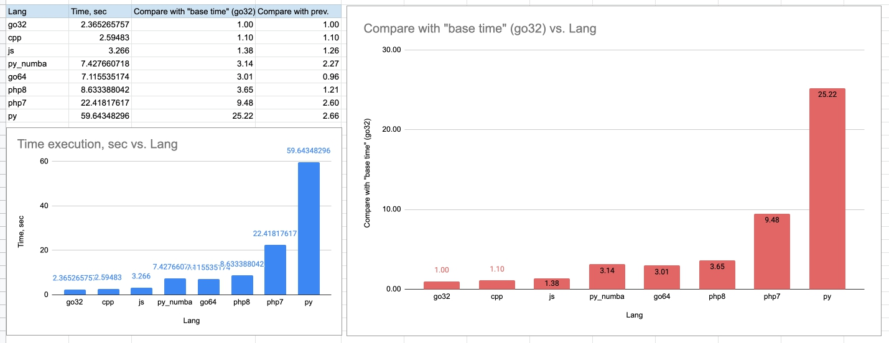

## Введение в PHP

`PHP` (англ. PHP: Hypertext Preprocessor) - скриптовый язык, используемый для разработки веб-приложений.
`PHP` является одним из самых распространенных языков программирования для создания динамических веб-приложений.

По индексу PYPL `PHP` занимает 6 место в мире (данные на июнь 2022 года). PYPL (PopularitY of Programming Language Index) сформирован на основе анализа частоты поиска обучающих материалов по языку программированию в Google.

## Особенности PHP
- Это интерпретируемый язык
- Скрипты `PHP` исполняются на сервере, а результат возвращается в браузер как простой HTML
- `PHP` файлы содержат HTML, JS, CSS, SQL, текст, PHP код
- Совместим со всеми серверами (Nginx, Apache, IIS и т.д.)
- Поддерживает большинство БД

## Что может PHP?
- генерировать динамическое содержимое страницы
- создавать, открывать, читать, записывать, удалять и закрывать файлы на сервере
- собирать данные формы
- отправлять и получать файлы cookie
- добавлять, удалять, изменять данные в БД
- шифровать данные и т.д.

## Почему стоит выбрать PHP?

- на `PHP` написаны Facebook, VK, Wikipedia, Ted, BlaBlaCar, Youtube, Avito, Badoo и т.д. 
- на `PHP` написаны популярные системы управления контентом (CMS): **WordPress, Joomla!, Drupal**
- постоянное развитие и новые релизы на `PHP`
    - версия 7 - 2015 года - существенное улучшение производительности и расходования памяти
    - версия 7.4 - 2019 год - добавлены типизированные свойства и стрелочные функции [Подробнее](https://www.php.net/manual/ru/migration74.new-features.php#migration74.new-features.core.typed-properties)
    - версия 8.0 - 2020 год - поддержка union-типов, [JIT-компиляция](https://ru.wikipedia.org/wiki/JIT-%D0%BA%D0%BE%D0%BC%D0%BF%D0%B8%D0%BB%D1%8F%D1%86%D0%B8%D1%8F) и атрибуты (также известны как аннотации)
    - версия 8.1 - 2021 год - добавлен новый тип enum, readonly свойства классов, улучшение производительности и т.д.
    - версия 8.2 - 2022 год - readonly для классов целиком, новый генератор случайных чисел (объектный и лучше чем старые), константы в трейтах и т.д.
- низкий порог входа в разработку на `PHP` и постоянное развитие
- огромное сообщество
- поддерживаемые удобные фреймворки для разработки приложений от сайта визитки до Enterprise приложения
- средняя зарплата 177 тысяч рублей, медианная - 155 тысяч (по данным https://zarplan.com/)

## Benchmarks

----------

## Где запускать PHP?

- IDE:
    - рекомендуемая бесплатная учебная лицензия [PHPStorm](https://www.jetbrains.com/help/phpstorm/installation-guide.html)
    - [Visual Studio](https://visualstudio.microsoft.com/)
    - [Dreamweaver](https://helpx.adobe.com/dreamweaver/get-started.html)
- Песочницы:
    - https://sandbox.onlinephpfunctions.com/
    - Scratch files в вашей IDE (например, в PhpStorm https://www.jetbrains.com/help/phpstorm/scratches.html)

### Дополнительная литература:
1. [Особенности работы PHP интерпретатора](https://ru.wikipedia.org/wiki/PHP#%D0%9E%D1%81%D0%BE%D0%B1%D0%B5%D0%BD%D0%BD%D0%BE%D1%81%D1%82%D0%B8_%D0%B8%D0%BD%D1%82%D0%B5%D1%80%D0%BF%D1%80%D0%B5%D1%82%D0%B0%D1%82%D0%BE%D1%80%D0%B0)

