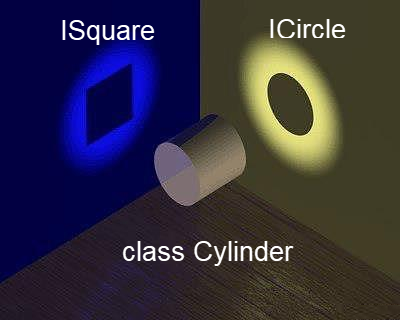

# Объектно-ориентированное программирование в PHP

## Объекты и классы

### Терминология

Названия сущностей в ООП могут отличаться между языками. В PHP приняты следующие обозначения:

* Класс (class) - описание типа данных, содержащего методы и поля
* Метод - то же, что и функция, но внутри класса
* Свойство - то же, что и переменная, но внутри класса
* Объект класса (или просто объект, object) - переменная, типом которой является класс

### Объявление класса

Для объявления класса используется ключевое слово *class*

```injectablephp
class ComplexNumber //Комплексное число
{
    public $re, $im; //Свойства класса: действительная и мнимая части
    function add($re, $im) // Метод класса: добавление числа, заданного действительной и мнимой частями
    {
        $this->re += $re;
        $this->im += $im;
    }
}
```

Псевдопеременная `$this` указывает на текущий объект класса, доступ к свойствам и методам объекта осуществляется через
стрелку -> ($ после стрелки при обращении к свойствам не нужен).

### Создание объекта

Для создания объекта класса используется ключевое слово *new*

```injectablephp
//Создаём объект
$obj = new ComplexNumber(); 
// () после названия класса можно опустить, если в конструктор не передаётся параметров:
// $obj = new ComplexNumber;
//Присваиваем значение свойствам
$obj->re = 5;
$obj->im = 22;
//Получаем значение свойства
echo $obj->re;
//Вызываем метод
$obj->add(10.1, -3); 
//Выводим результат
echo $obj->re."+".$obj->im."i";
```

### Работа с несколькими объектами

В параметры методов можно передавать другие объекты, в том числе объекты того же класса. Пример выше можно переписать:

```injectablephp
class ComplexNumber //Комплексное число
{
	public $re, $im;
	function add(ComplexNumber $cn)
	{
		$this->re += $cn->re;
		$this->im += $cn->im;
	}
}
$obj1 = new ComplexNumber;
$obj1->re = 5;
$obj1->im = 22;
$obj2 = new ComplexNumber;
$obj2->re = 10.1;
$obj2->im = -3;
$obj1->add($obj2);
echo $obj1->re."+".$obj1->im."i"; 
```

Суммируем комлексное число с комплексным числом, так куда логичнее.

### Преобразование в строку

В примерах выше приходилось вручную форматировать строковое представление комплексного числа. Для того чтобы сделать это
правильно, у каждого класса можно определить специальный метод *__toString()*, который будет автоматически вызван каждый
раз при преобразовании объекта в строку - например, при интерполяции строки в кавычках, конкатенации через точку, выводе
через *echo* и т.д. Если *__toString()* не определён, php выдаст фатальную ошибку при таком преобразовании.

```injectablephp
class ComplexNumber 
{
    public $re, $im;
    
    function add(ComplexNumber $cn)
        {
            $this->re += $cn->re;
            $this->im += $cn->im;
        }
        
    function __toString()
        {
            return $this->re."+".$this->im."i";	
        }
}

$obj1 = new ComplexNumber;
$obj1->re = 5;
$obj1->im = 22;
$obj2 = new ComplexNumber;
$obj2->re = 10.1;
$obj2->im = -3;
$obj1->add($obj2);
echo $obj1;
```

### Конструкторы

Для инициализации объекта после создания можно использовать специальный метод - конструктор. Определяется он в PHP так:
*__construct(<аргументы>)*. При определении конструктора с обязательными параметрами, создание класса без параметров
станет невозможным. Чтобы этого избежать, некоторые или все аргументы можно объявить по умолчанию. Делается это как для
любой другой функции.

```injectablephp
class ComplexNumber 
{
	public $re, $im;
	function add(ComplexNumber $cn)
	{
		$this->re += $cn->re;
		$this->im += $cn->im;
	}

	function __construct($re=0, $im=0) 
    {
        $this->re = $re;
        $this->im = $im;
    }

    function __toString()
    {
        return $this->re."+".$this->im."i";
    }
}

$obj1 = new ComplexNumber(5, 22);
$obj2 = new ComplexNumber(10.1, -3);
$obj1->add($obj2);
echo $obj1; 
```

### Деструктор

Помимо конструктора, в классе может быть описан деструктор - специальная функция, которая будет вызвана при уничтожении
объекта - явном, например, через unset или неявном при завершении работы скрипта или сборке мусора после выполнения
функции. Основное назначение - правильное освобождение ресурсов, например, закрытие каналов или запись в файл кеша перед
закрытием файла. Деструктор объявляется так:
*function __destruct() { … }*

### Сборка мусора

Каждый раз при копировании объекта по ссылке или создании нового объекта, PHP увеличивает счётчик ссылок на объект в
памяти, а при уничтожении - уменьшает. Если не осталось ни одной ссылки, специальный алгоритм уничтожает объект и
очищает память. Этот алгоритм называется "сборщиком мусора" и явно вызывать его не нужно. Допустим, у нас есть 2
объекта, хранящих ссылки друг на друга. Эти объекты могут оставаться в памяти вечно (до конца работы скрипта) - счётчик
ссылок никогда не достигнет 0. Эта проблема называется проблемой циклических ссылок и приводит к утечке памяти. К
счастью, в PHP уже начиная с 5.3 есть механизм решения проблемы.

### Модификаторы доступа

Обычно не все методы и свойства класса должны быть доступны для чтения и записи снаружи от методов самого класса.
Свойства вообще считается дурным тоном выставлять наружу (вместо этого создают специальные методы - сеттеры и геттеры,
позволяющие установить и считать значение соответственно). В примерах мы использовали ключевое слово *public*,
означающее, что метод или свойство доступны откуда угодно из скрипта. Другие варианты модификаторов доступа - *private*,
означающий, что поле доступно только из методов класса (доступны будут даже приватные поля другого объекта того же
класса!) и
*protected*, означающий доступность из того же класса и его наследников.

### Неявное объявление свойств

PHP позволяет обращаться к необъявленным свойствам и внутри, и снаружи класса. При присвоении значения несуществующему
свойству, оно создастся (так же, как с массивами). Более того, допустима такая конструкция:

```injectablephp
$key = "test";
$obj->$key = 42;
```

В этом случае в объекте $obj будет создано свойство test со значением 42 и никаких ошибок PHP не выдаст.

### Перехват обращений к членам класса

Если программа пытается обратиться к *несуществующим* членам объекта, PHP пытается запустить особые методы, если они
определены:

* При чтении несуществующего свойства: *__get()*, в параметрах передаётся название свойства.
* При записи несуществующего свойства: *__set()*, в параметрах передаются имя свойства и новое значение.
* При выполнении несуществующего метода: *__call()*, в параметрах передаются имя метода и список аргументов. Если
  методы *__get()* и *__call()* не определены, при таком вызове произойдёт ошибка.

Таким способом злоупотреблять не рекомендуется, но в некоторых случаях это вполне оправдано, например, если нужно
сделать объектную обёртку для базы данных или файла в определённом формате (JSON, XML и т.д.)

### Статические поля и методы

Обычные поля и методы хранятся и выполняются соответственно для объекта класса, однако допустимо создавать поля и
методы, относящиеся к самому классу, а не к его экземплярам. Такие поля и методы называются статическими. Для объявления
используется синтаксис:

*<модификатор доступа> static $<cвойство>*

*<модификатор доступа> static function <метод>(...) {...}*

Для доступа вместо названия объекта и стрелки -> используется название класса и ::

*someclass::staticProperty*

*someclass::staticMethod()*

*$this* из статических методов недоступен. Вместо него для доступа к другим статическим методам и свойствам используется
ключевое слово *self::*

### Константы класса

В классе могут быть определены собственные константы. Для этого используется ключевое слово const:

```injectablephp
const INTERNAL_NAME="MyClass";
```

Для обращения к константам класса нужно использовать тот же синтаксис, что и для обращения к статическим членам:
*<название класса>::INTERNAL_NAME* или, в методах класса, *self::INTERNAL_NAME*. Константы класа принято писать в
верхнем регистре, как и любые другие константы в PHP.

### Клонирование объектов

Объекты в PHP копируются по ссылке, однако существует специальная операция для создания независимой копии. Синтаксис
этой операции такой:

```injectablephp
$clone = clone $dolly;
```

По умолчанию, клонирование возможно для любых объектов. Копия, создаваемая при этом будет "неглубокой" (shallow):
свойства-ссылки на другие объекты скопируются как ссылки на те же объекты. Во многих случаях нас не устраивают одно или
оба предыдущих утверждения. PHP предоставляет возможность управлять клонированием или ограничивать его. При клонировании
PHP сначала создаёт побитовую копию объекта, а затем пытается вызвать специальный метод *__clone()*, если он определён в
классе. Внутри этого метода можно запрограммировать дополнительную логику для клонированного объекта, например, заменить
ссылку на другой объект ссылкой на клон:

```injectablephp
class MyClass
{
    private MyClass $bro;
	
	//…
	
    public function __clone()
    {
	    $this->bro = clone $this->bro;
    }
}

```

Если *__clone()* объявить приватным, клонирование объекта будет запрещено!

### Перехват сериализации

В PHP за сериализацию (обратимое преобразование в строку специального формата) отвечает функция *serialize()*, а за
обратную десериализацию - *deserialize()*. Внутри класса можно настраивать сериализацию (а конкретно - определять, какие
свойства должны подлежать сериализации) и десериализацию (указывая код, выполняемый после распаковки объекта, например,
инициализировать несериализируемые динамические свойства). Для этого можно определить 2 специальных метода:

* *__sleep()* - вызывается перед сериализацией;
* *__wakeup()*  - вызывается после десериализации объекта.

При сериализации, если он определён, вызывается метод объекта *__sleep()*. Этот метод должен возвращать список названий
свойств, подлежащих сериализации (массив строк). Сериализовать можно как public, так и private или protected поля. После
десериалиции, когда уже восстановлены все сериализованные поля, вызывается (если определён) метод *__wakeup()*. В этом
методе можно, например, открыть используемые объектом файлы или выполнить другие действия.

## Наследование

### Синтаксис наследования

Для указания, что класс является наследником другого класса используется ключевое слово extends:

```injectablephp
class MyChild extends MyParent {}
```

При этом:

* в *MyChild* будут доступны все *protected* свойства и методы;
* *public* методы и свойства класса *MyParent* будут доступны при вызове из объектов класса *MyChild*.
* Для запрета на наследование можно использовать ключевое слово *final* при объявлении класса: *final class
  SomeClass...*

Множественное наследование в PHP не предусмотрено: у класса может быть не более 1 родителя

### Переопределение методов

Если в потомке будет описан метод, который называется так же, как в родителя, скажем, что метод был переопределён. При
этом переопределённый метод может отличаться от родительского сигнатурой. Для вызова родительского метода изнутри
переопределённого, можно использовать *parent::*

```injectablephp
class MyParent
{	
    public function __construct($arg1, $arg2) 
    {
        //...
    }
}

class Child extends MyParent
{	

    //...
    
    public function __construct($arg) 
    {
	    parent::__construct($arg, null);	
    }
    
    //...
    
}

```

При переопределении модификатор доступа должен быть таким же, как у родительского метода или менее строгий:

* *private* можно переопределить как *private*, *protected* или *public*.
* *protected* - как *protected* или *public*
* *public* - только как *public*
  Чтобы запретить переопределение, можно для метода указать модификатор *final*

```injectablephp
class MyClass 
{
    //...
    
    public final function SomeMethod() 
    {
        //...
    }
    
    //...
    
}
```

Все методы, не помеченные как финальные, в PHP являются виртуальными (переопределяемыми)

### Переопределённые константы

Внутри объектов класса можно использовать стандартные константы, по которым можно определить текущий класс и метод:

* *\_\_CLASS__* - возвращает имя текущего класса
* *\_\_METHOD__* - возвращает имя текущего метода (работает и внутри обычных функций)

### Анонимные классы

Начиная с PHP 7, по аналогии с анонимными функциями появились анонимные классы:

```injectablephp
class Container
{	
	private $id = 1;
	public function anonym()
	{
		return new class ($this->id)  extends Container
		{
			private $index;
			public function __construct($id) 
			{
				$this->index = $id;
            }
            
            public function print()
            {
	            echo "Id: $this->index";
            }
        };
    }
}

```

### Абстрактные классы и методы

Для объявления абстрактного класса или метода в PHP используется ключевое слово *abstract*.

* Абстрактный метод нельзя вызвать напрямую, не переопределив в наследнике.
* Объект абстрактного класса нельзя создать напрямую.
* Любой класс, в котором есть хотя бы один абстрактный метод должен быть объявлен абстрактным.

Для абстрактных методов не нужно объявлять тело:

```injectablephp
abstract class SomeClass {
    abstract public function SomeMethod($arg);
}
```

### Полиморфизм

В PHP, как и любом объектном языке, допускается использовать наследника везде, где можно использовать предка. Для
уточнения типа можно (и нужно!) в аргументе и возвращаемом значении функции использовать название класса везде, где это
имеет смысл:

```injectablephp
function SomeMethod(SomeClass $arg): SomeOtherClass 
{ 
    //…
} 
```

Для определения принадлежности к иерархии наследования, применяется логический оператор *instanceof*

```injectablephp
if ($obj instanceof SomeClass) {
// ...
} 
```

Допускается в качестве второго аргумента использовать и класс, и строковое представление. Оператор вернёт *true*, только
если первый операнд является объектом класса *SomeClass* или его наследником.

## Интерфейсы

Использование интерфейсов оправдано отсутствием множественного наследования и контрактным подходом к разработке:
интерфейс описывает, что должен уметь класс с точки зрения конкретной абстракции и только это, игнорируя всё ненужное,
что ещё есть в классе. Класс может реализовывать любое количество интерфейсов.



### Синтаксис интерфейсов в PHP

```injectablephp
interface BasicContract
{
    //публичные методы без тела
}

class BasicClass implements BasicContract//, SomeOtherInterface, ...
{

}
```

Если класс не реализует всех методов всех своих интерфейсов, возникнет фатальная ошибка. Исключение для абстрактных
классов - в них нереализованные методы интерфейса станут абстрактными методами и их должны будут реализовывать потомки.

### Наследование интерфейсов

Интерфейсы могут наследоваться от других интерфейсов. Синтаксис такой же, как у классов - используется ключевое слово
extends. Если класс реализует дочерний интерфейс, считается, что он реализует и все родительские, второй раз их
указывать не нужно. Интерфейсы поддерживают множественное наследование: 1 интерфейс может быть унаследован от нескольких
других.

### Трейты

Трейты содержат общие фрагменты, которые могут повторно использоваться разными классами. Трейты являются одним из
механизмов компенсации отсутствия множественного наследования в PHP. Для объявления трейта используется ключевое слово *
trait*, для использования - *use* в начале тела класса (после { ). Класс может использовать несколько трейтов.

```injectablephp
trait FirstTrait 
{
	private $someKey;
	public function someMethod()
	{
		echo $this->someKey;
	}
}

trait SecondTrait 
{
	public function doLogic()
	{
		return 2*2;
	}
}

class MyClass 
{
    use FirstTrait, SecondTrait; 
}

```

Если класс унаследован от другого класса и при этом использует трейты, порядок перегрузки методов такой: трейты
перегружают методы базового класса; методы текущего класса перегружают методы трейтов. Если в нескольких трейтах
используются методы с одинаковыми названиями, возникнет конфликт. Его можно разрешить, используя специальный синтаксис в
фигурных скобках после *use*, который рассмотрим на [примере](Examples/Traits.php)

## Пространство имён

В большом проекте, использующем сторонние библиотеки, неизбежно возникает проблема коллизии имён классов и функций. Для
её решения можно давать неоправданно длинные имена, но к счастью в PHP реализован механизм пространств имён.
Пространство имён (*namespace*) - это некоторый именованный фрагмент программы. Всё находящееся в этом фрагменте при
вызове извне получает префикс, совпадающий с наименованием пространства имён. Для объявления пространства имён
используется ключевое слово namespace. Существуют встроенные зарезервированные пространства имён: php и PHP

```injectablephp
namespace PHP7; //всё, что в данном файле идёт ниже объявления будет относиться к пространству имён PHP7

function debug($obj) 
{
	echo "<pre>";
	print_r($obj);
	echo "</pre>";
}

class Page
{
	protected $title;
	protected $content;
	public function __construct($title = ' ', $content = ' ')
	{
		$this->title = $title;
		$this->content = $content;
	}
}

```

Пространства имён распространяются на классы (включая трейты), интерфейсы, функции и константы.

При обращении к тому, что находится внутри пространства имён из файла, относящегося к другому пространству имён, нужно
указывать префикс. Имя вместе с префиксом называется *квалифицированным именем*

```injectablephp
$page = new PHP7\Page('О нас', '42');
PHP7\debug($page);
```

### Иерархия пространства имён

Пространства имён похожи на файловые системы. Используя \ мы можем добавлять сколько угодно уровней. Писать каждый раз
полное имя было бы неудобно, но, к счастью, и не нужно - действуют те же правила, что и для относительных путей: PHP
пытается в начало подставлять текущее пространство имён. В случае конфликта, для вызова стандартных функций нужно
указывать "корневое" пространство имён \

```injectablephp
namespace PHP7;

$page = new classes\Page(...) // с учётом текущего неймспейса, получится PHP7\classes\Page
function strlen ($str)  //Функция PHP7\strlen()
{
    return mb_strlen($str);
}
echo strlen("42"); //вызов функции PHP7\strlen()
echo \strlen("42"); //вызов стандартной функции strlen()

```

### Импортирование пространств имён

Для сокращения обращений к другим пространствам имён можно использовать ключевое слово use, позволяющее создавать
псевдоними для пространств имён или классов из них.

```injectablephp
use PHP7\classes\Page as Page;
use PHP7\classes\functions as functions;
```

Если не указан псевдоним, по умолчанию возьмётся последний элемент (после последнего \), т.е. пример выше эквивалентен

```injectablephp
use PHP7\classes\Page;
use PHP7\classes\functions;
```

### Пространство имён и файловая система

Всегда нужно стремиться, чтобы структура каталогов в вашем проекте совпадала со структурой пространств имён, а имена
классов совпадали с именами файлов (с добавлением ".php") Это сильно упрощает подключение файлов кода через
require/include - можно использовать константу __DIR__. При использовании автозагрузки это правило становится
практически обязательным и диктуется PSR.

### Автозагрузка классов

PHP позволяет не использовать require/require_once для каждого подключаемого класса. Существуют механизмы, позволяющие
делать это автоматически при первом обращении к ещё не подключенному классу. До PHP 7.2 существовал такой способ:
определение специальной функции, которая автоматически вызовется при попытке обращения к неизвестному классу: *__
autoload($classname)*. В ней один раз описывается логика вычисления имени файла по названию класса и используется
require_once. В PHP 7.2 этот способ был признан устаревшим и с PHP 8 не работает.

Современным способом считается использование встроенной функции *spl_autoload_register*. Она позволяет создать целую
цепочку функций автозагрузки, которые будут выполняться одна за другой, пока не будет найден нужный файл.

```injectablephp
spl_autoload_register(function ($class_name) {
    include $class_name . '.php';
});

$obj  = new MyClass1();
$obj2 = new MyClass2(); 
```

Аргументы этой функции:

* callable $autoload_function, получающая на вход квалифицированное имя класса и внутри себя подключающая нужный файл.
  Если не указана, будет использована реализация по умолчанию, которая, если не настроена дополнительными функциями,
  будет пытаться подключить файлы $classname.php и $classname.inc (т.к. мы говорим про квалифицированное имя,
  пространство имён будет совпадать с путём в файловой системе, поэтому так важно чтобы они совпадали);

* bool $throw (по умолчанию true) - нужно ли выбрасывать исключение, если подключить файл не удалось

* bool $prepend (по умолчанию false) - нужно ли добавить функцию в начало очереди функций автозагрузки, а не в конец


