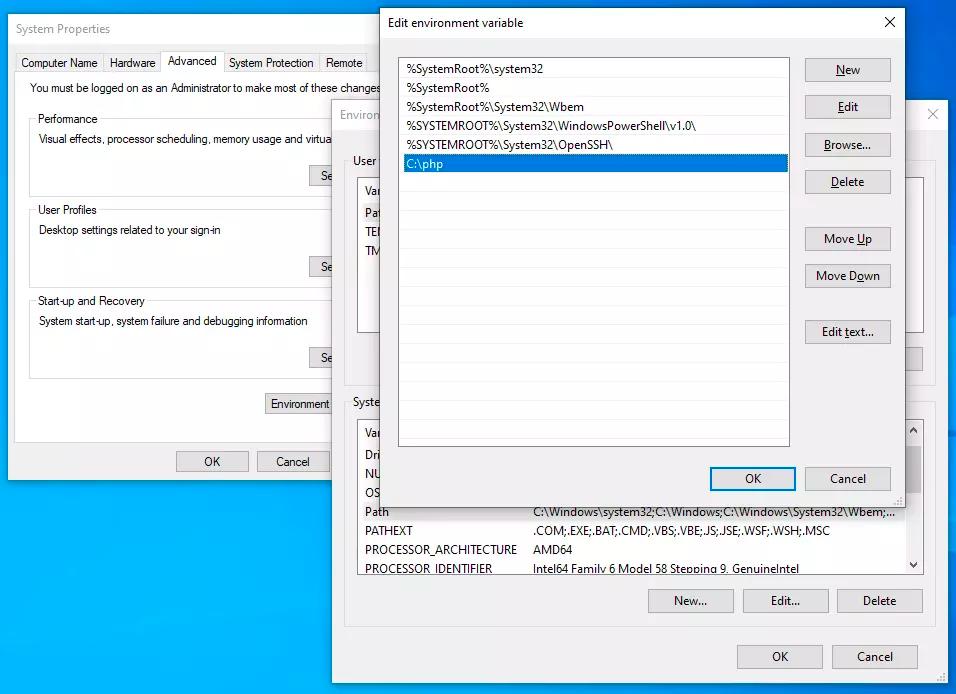

## Установка окружения


## PHP 8.0
**[Инструкция по установке PHP под разные платформы с официального сайта](https://www.php.net/manual/ru/install.php)**

### Установка на Unix-системы
0. Выберите пакетный менеджер своего дистрибутива. Мы будем рассматривать установку через `apt`
0. Добавьте репозиторий для скачивания нужной версии `php`
    ```
    sudo apt install software-properties-common
    sudo add-apt-repository ppa:ondrej/php
    ```
0. Установите `php v8.0`
    ```
    sudo apt update
    sudo apt install php8.0
    ```

### Установка на macOS
1. Установите `brew` - https://docs.brew.sh/Installation

    Apple Silicon M1 - `cd /opt/`

    macOS Intel - `cd /usr/local/` 

   ```
   mkdir homebrew && curl -L https://github.com/Homebrew/brew/tarball/master | tar xz --strip 1 -C homebrew
   ```

0. Установите `php v8.0` вместе с расширениями https://formulae.brew.sh/formula/php@8.0
0. Проставьте symlink 
   ```
   cd homebrew/opt/
   ln -s ../Cellar/php@8.0/{yourCurrentPhpVersion} php
   ```

### Установка в системах Windows

0. Скачайте `php v8.0` с официального сайта http://windows.php.net/download. Для данного курса рекомендуется версия Non Thread Safe, т.к. мы используем встроенный сервер.
0. Распакуйте архив в удобную папку (например, c:\php)
0. Проверьте
    ```
    cd c:\php
    php -v
    ```
0. Пропишите переменные окружения
   - Перейдите в настройки системы (панель управления-система, либо правой кнопкой по "Компьютер" - свойства)
   - Дополнительные параметры системы->переменные среды
   - В "системных переменных" найти PATH, изменить
   - Добавить через ; "c:\php", сохранить

   

#### Проверка установки PHP
```php -v```


## Composer

Установка [composer](https://getcomposer.org/download/).

#### Проверка установки composer

- перейти в проект
```
cd /{yourPathToProject}/PHP-Base-Course-Admin
```
- запустить
```
composer install
```
## Установка postgresql

- https://www.enterprisedb.com/downloads/postgres-postgresql-downloads - скачиваем последнюю версию
- при установке, locale выбираем English
- добавляем путь до директории с кластерами(bin) в переменную среды, например C:\PostgreSQL\14\bin
- пробуем зайти под пользователем postgres, пишем в терминале: psql -U postgres 
